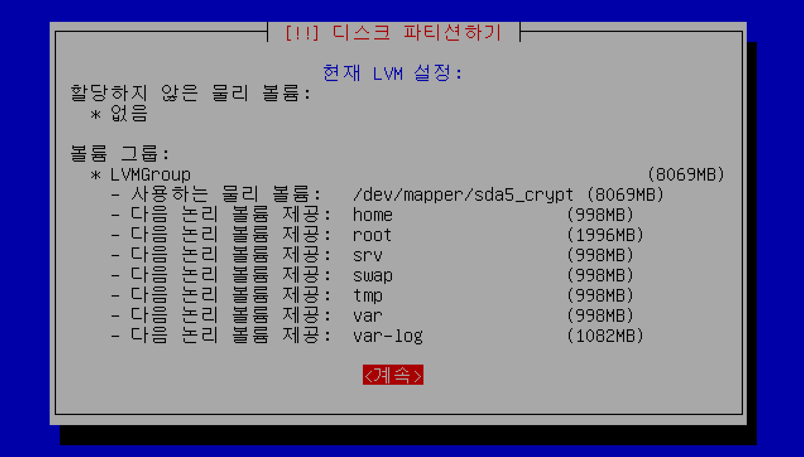
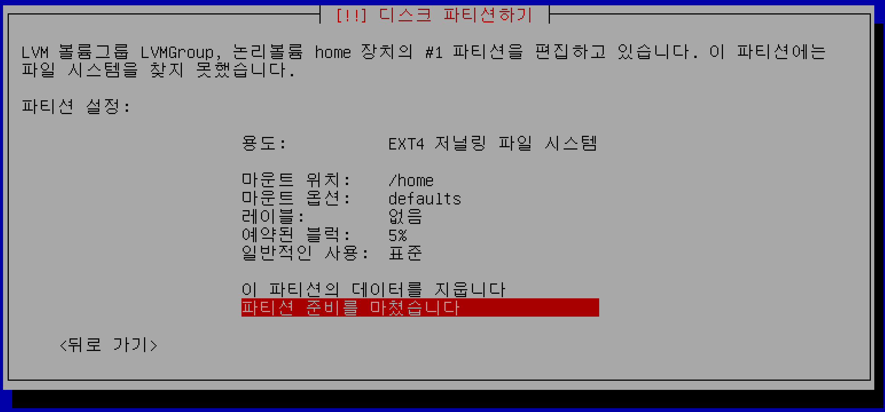
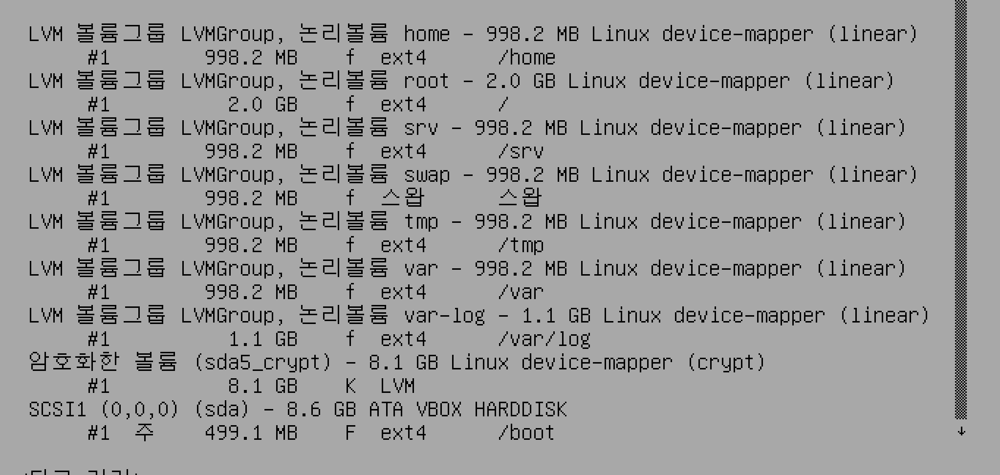
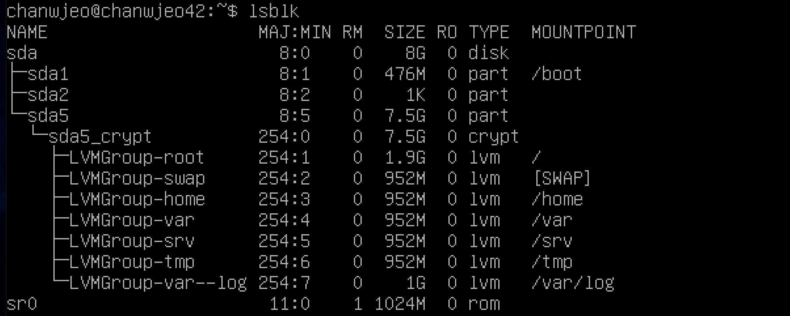

# Born2beroot

## Mandatory part

1. 서버 설정
- 운영체제
	- Debian
		- 운영체제 시작 시 AppArmor 또한 구동되어야 함.
- LVM을 이용한 최소 2개의 암호화된 파티션 생성
	- LVM(Logical Volume Manager)은 하나의 디스크를 논리적으로 나누어 사용하거나, 여러개의 디스크를 논리적으로 묶어서 사용하는 등, 리눅스에서 디스크를 효율적으로 관리하기 위한 방법.
		LVM에는 크게 PV, PE, VG, LV, LE라는 개념이 있다.
		- PV (Physical Volume) : 실제로 존재하는 물리 볼륨
		- VG (Volume Group) : PV를 1개 이상 묶어서 그룹화하는 것이다.
		- LV (Logical Volume) : VG에서 논리적으로 Volume을 지정한다. VG의 용량을 초과하여 지정할 수 없다.
		- PE(Physical Extent) 와 LE(Logical Extent)는 각각 PV와 LV를 이루는 최소 단위이고 기본 4MB로 할당되어있다.
- aptitude VS apt

```
apt
Apt : Advanced Packaging Tool
소프트웨어의 설치와 제거를 처리하는 패키지 관리 툴이다. 초기에는 .deb 패키지를 관리하기 위해 만들었지만 현재는 rpm 패키지 매니저와도 호환된다.
apt는 그래픽 인터페이스 없이 명령어로 사용한다.
설치할 패키지 명을 입력하면, '/etc/apt/sources.list'에 지정된 소스 목록에서 해당 패키지 + 종속성 목록과 함께 찾아 자동으로 설치한다. 그렇기 때문에 어떤 패키지를 설치할 때 종속성 문제를 걱정하지 않아도 된다.
또 굉장히 유연해서 사용자가 직접 새로운 소스 목록을 추가하거나 시스템이 업그레이드 되도 해당 패키지를 업데이트 하지 않게 해 현재 버전을 계속 사용하는 등의 작업을 할 수 있다.

Aptitude
Aptitude는 사용자 인터페이스를 추가해 사용자가 대화형으로 패키지를 검색해 설치, 제거할 수 있는 high-level 패키지 관리 도구다. 데비안을 위해 만들어졌지만 rpm 기반 패키지까지 확장된다.
그리고 텍스트 기반 대화형 인터페이스와 비대화형 command line 모드에서도 작동한다.

차이점
Aptitude가 더 방대하고 apt-get, apt-cache를 포함한 기능들을 포함한다.
apt-get이 패키지 설치, 업그레이드, 시스템 업그레이드, 종속성 검사 등을 한다면, aptitude는 이보다 더 많은 일을 할 수 있다. 설치된 패키지 목록, 패키지를 자동 또는 수동으로 설치하도록 표시, 업그레이드에 사용할 수 없는 패키지 보관 등이 있다.

이 외 차이저을 보면,
1. 어떤 패키지를 삭제할 때, aptitude는 사용되지 않는 패키지까지 삭제한다. 반면 apt 는 사용자가 '-auto-remove', 'apt-get autoremove'를 명시해줘야 한다.
2. 이거는 찾아보면서 되게 재밌었던 점인데, aptitude는 'why', 'why-not' 명령어를 이용해 어떤 동작이 왜 안되고 되는지를 볼 수 있다.
3. apt는 설치, 제거 중 충돌이 일어날 경우 종료되지만 aptitude는 해결 방법을 제시할 수 있다.
```

- SELinux - Security Enhanced Linux
	- 관리자가 시스템 액세스 권한을 효과적으로 제어할 수 있게 하는 Linux 시스템용 보안 아키텍처.
```
MAC
시스템 전체에 보안 설정
```
모든 걸 차단하고 필요한 것만 허용한다.

SELinux는 setuid 비트가 켜져 있거나 루트로 실행되는 데몬 프로세스 프로그램들은 샌드박스안에서 별도의 도메인으로 격리되어 낮은 등급으로 실행되므로 루트 권한을 탈취해도 해당 도메인에만 영향을 미치고 전체 시스템에 미치는 영향을 최소화 한다.

-------------------------

- AppArmor - Application Armor
	- 시스템 관리자가 프로그램 프로필 별로 프로그램의 역량을 제한할 수 있게 해주는 리눅스 커널 보안 모듈이다.

```
MAC
개별 응용프로그램을 보호. 응용프로그램 단위 보안.
```

**MAC - 강제접근통제, Mandatory Access Control**
미리 정해진 정책과 보안 등급에 의거하여 주체에게 허용된 접근 권한과 객체에게 부여된 허용 등급을 비교하여 접근을 통제하는 모델.

높은 보안을 요구하는 정보는 낮은 보안 수준의 주체가 접근할 수 없으며 소유자라고 할 지라도 정책에 어긋나면 객체에 접근할 수 없으므로 강력한 보안을 제공한다.

**Debian Setup**

디스크 분할에서 수동(Manual 선택)

그 후, 주 영역과 논리 영역으로 파티션 분할. 

논리 영역에서 부팅을 안하는 이유는 논리 영역으로 설정은 했지만 확장 영역에 속해야한다.

확장 영역이란 주 영역에서 사용가능한 영역.

실제 데이터는 저장할 수 없으므로 마운트 불가능.

이와 같이 설정 후, 암호화를 위해 Configure encryped volumns 선택.

create 선택 후, sda5 선택.

그 후 암호화 여러 설정 후, Configure the Logical Volume Manager 선택.



- 마운트 과정 중 LVMGroup - LVhome 선택

Ext4 file system : Ext3 file system을 개선한 버전으로 대용량 파일 시스템을 지원함. Ext3과 호환 가능하므로, Ext4 사용 권장.

마운트 위치도 변경 : 없음 -> /home

- 각각의 그룹을 용도에 맞게 변경
단, swap은 swap area 선택, var-log는 경로 직접 입력으로 /var/log 입력


- GRUB(Grand Unified Bootloader) 부트로더 설정 (YES -> /dev/sda 선택)
부트로더 : 운영 체제가 실행되기 이전에 미리 실행되어 커널이 올바르게 실행될 수 있도록 사전작업을 수행하고, 최종적으로는 아무 이상 없이 운영체제를 실행시키기 위한 프로그램 (부팅의 전 과정을 진행하는 부팅 전문 프로그램을 의미)

여기까지 수행하면 설치를 모두 마치게 된다.


설치 후 접속하여 lsblk 명령어 입력했을 때


**sudo setup**

subject의 내용을 충실하게 따라야 하기 때문에 순차적으로 진행한다.

1. root 계정으로 전환

```
su -
```

2. sudo 패키지 설치

```
apt-get install sudo
```

- sudo 패키지 설치 여부
dpkg -l | grep 'sudo'

- sudo log를 저장할 수 있는 디렉토리 생성
```
mkdir /var/log/sudo
```

- sudo 설정
```
visudo
```

설정 창에 들어가면
```
Defaults	secure_path="/usr/local/sbin:/usr/local/bin:/usr/sbin:/usr/bin:/sbin:/bin:/snap/bin"

Defaults	authfail_message="Authentication attempt failed custom."
Defaults	badpass_message="Wrong password custom."
Defaults	log_input
Defaults	log_output
Defaults	requiretty
Defaults	iolog_dir="/var/log/sudo/"
Defaults	passwd_tries=3
```
로 수정한다.

* authfail_message

	권한 획득 실패(즉, sudo 인증 실패) 시 출력하는 메세지.

* badpass_messgae

	sudo 인증에서 비밀번호를 틀렸을 시 출력하는 메세지.

* log_input

	sudo 명령어 실행 시 입력된 명령어를 log로 저장하겠다는 설정.

* log-output

	sudo 명령어 실행 시 출력 결과를 log로 저장하겠다는 설정.

* requiretty

	sudo 명령어 실행 시 tty를 강제하는 설정.

* iolog_dir

	sudo log 저장 디렉토리를 지정하는 설정.

* passwd_tries

	sudo 실행 횟수를 지정하는 설정.(default = 3)

<pre><code>
Your password has to expire every 30 days.
여러분의 비밀번호는 30일마다 소멸되어야 합니다.

The minimum number of days allowed before the modification of a password will be set to 2.
비밀번호 변경을 위해 기다려야 하는 기간은 최소 이틀로 설정되어야 합니다.

The user has to receive a warning message 7 days before their password expires.
유저는 비밀번호 소멸 7일 전에 경고 메시지를 받아야 합니다.

Your password must be at least 10 characters long. It must contain an uppercase letter and a number. Also, it must not contain more than 3 consecutive identical characters.
비밀번호는 최소 10글자 이상이 되어야 하고, 대문자와 숫자를 포함하여야 하며, 같은 글자가 3번 이상 연속되면 안 됩니다.

The password must not include the name of the user.
비밀번호에 유저명이 포함되면 안 됩니다.

The following rule does not apply to the root password: The password must have at least 7 characters that are not part of the former password.
다음 규칙은 루트 계정의 비밀번호에 적용되지 않습니다: 비밀번호는 이전 비밀번호에 포함되지 않는 문자를 최소 7개 이상 포함하여야 합니다.

Of course, your root password has to comply with this policy.
당연히, 루트 권한 비밀번호 또한 해당 규칙을 따라야 합니다.
</code></pre>

<pre><code>
// 비밀번호 정책 설정을 위한 패키지 설치
sudo apt install libpam-pwdquality

sudo vi /etc/pam.d/common-password


// 다음과 같이 수정
password	requisite	pam_pwquality.so retry=3 minlen=10 difok=7 ucredit=-1 lcredit=-1 dcredit=-1 reject_username enforce_for_root maxrepeat=3

// 강화된 비밀번호로 적용하지 위해 명령어 실행
passwd -e [user_name]
</code></pre>

* retry=3

	비밀번호 입력 횟수 설정, 최대 3회 입력 가능.

* minlen=10

	비밀번호 최소 길이

* difok=7

	이전 비밀번호와 달라야하는 문자 수, root의 경우 이전 비밀번호를 저장하지 않기 때문에 적용되지 않음.

* ucredit=-1

	대문자 제한, -1은 최소 한 글자 이상을 의미함.

* lcredit=-1

	소문자 제한

* dcredit=-1

	숫자 제한

* reject_username

	유저 이름이 그대로 또는 뒤집혀서 비밀번호에 입력될 수 없음

* enforce_for_root

	해당 비밀번호 정책을 root에도 적용

* maxrepeat=3

	중복 글자 제한. 최대 3글자까지 중복 가능


